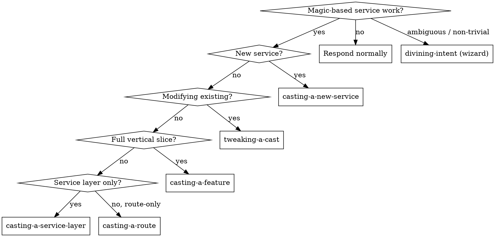

<SUBAGENT-STOP>
If you were dispatched as a subagent to execute a specific task, skip this skill.
</SUBAGENT-STOP>

<EXTREMELY-IMPORTANT>
If the user's request touches a magic-based microservice — scaffolding, adding a feature, adding a route, swapping storage, wiring observability — you MUST invoke a spellcasting skill BEFORE writing code or asking implementation questions.

IF A CAST APPLIES, YOU DO NOT HAVE A CHOICE. INVOKE IT.
</EXTREMELY-IMPORTANT>

## Instruction Priority

1. **User instructions** (CLAUDE.md, direct requests) — highest
2. **Spellcasting skills** — override default behavior for magic-based work
3. **Superpowers skills** — brainstorming, TDD, debugging still compose
4. **Default system prompt** — lowest

## Capability Boundary

Every cast and every template is hard-bounded to:

**In-bounds:** `github.com/tink3rlabs/magic/{storage, middlewares, observability, health, leadership, mql, errors, logger, pubsub}` · `github.com/tink3rlabs/todo-service` source layout · standard ecosystem (`chi`, `chi/middleware`, `chi/cors`, `chi/render`, `cobra`, `viper`, `slog`).

**Out-of-bounds — NEVER quote, import, or name in templates or generated code:** `github.com/blox-eng/common/*` (`commonmiddlewares`, `commonattachments`, `commonstorage`, `db.Bootstrap`, `db.Open`, `encryption`, `configinitializer`) · gate ACL `Guard` · any project-specific middleware (rate limit, audit, cache, default-tenant override).

Exhaustive surface: invoke the `magic-capabilities` skill.

## Cast Catalog

| Command | Skill | Use when | Produces |
|---|---|---|---|
| `/cast` | `divining-intent` | Non-trivial work; you need the wizard to map intent to casts | A markdown brief with the cast sequence and answers |
| `/cast:new <name>` | `casting-a-new-service` | Bootstrapping a brand-new magic-based service | Full service tree: main.go, cmd/, embedded config/, Makefile, Dockerfile, CI |
| `/cast:feature <name>` | `casting-a-feature` | Adding a complete resource end-to-end | Migration → types → service → route, with validation + tests |
| `/cast:service <name>` | `casting-a-service-layer` | Domain logic only, no HTTP yet | `pkg/types/<name>.go` + `pkg/features/<name>/service.go` + test |
| `/cast:route <name>` | `casting-a-route` | HTTP layer; auto-chains service layer if missing | `pkg/routes/<name>/{routes.go, validation.go, handler.go, routes_test.go}` + mount |
| `/cast:tweak` | `tweaking-a-cast` | Modifying existing code (add field, add filter, add guard, swap adapter) | Targeted diffs respecting DTO-completeness |

## Decision Flow

## Red Flags — Stop and Invoke a Cast

| Thought | Reality |
|---|---|
| "User just asked for a route, skip the wizard" | A route pulls types, validation, often service + migration. Use `casting-a-route` — it auto-chains. |
| "I'll copy from blox-1/base since it's right there" | blox-1 is inspirational. Out-of-bounds for templates. Use only `magic` + `todo-service`. |
| "I'll just use `commonmiddlewares.RateLimitMiddleware`" | Not in magic. Forbidden. |
| "Tiny tweak, just edit the file" | DTO-completeness: DB struct → Create DTO → Update DTO → validation → service → migration. Use `tweaking-a-cast`. |
| "Wizard is overkill for an obvious service" | Multi-tenancy, soft-delete, role guards aren't derivable from the description. Wizard exists for that. |
| "Scaffold first, tests after" | Casts ship `*_test.go` in the same pass. No "after". |
| "I'll write a custom auth middleware" | `middlewares.EnsureValidToken` + `RequireRole` are the only options in scope. |
| "Just add the field to the struct, the rest can wait" | Five-step DTO-completeness rule. All steps in one pass. |

## Composition with Superpowers

Spellcasting runs alongside `obra/superpowers`. `superpowers:brainstorming` still applies before broader product decisions; `superpowers:test-driven-development` discipline applies to all generated code; `superpowers:subagent-driven-development` is the right execution mode for a multi-cast sequence emitted by `divining-intent`.

## Skill Index

- `using-sorcery` — this skill, the entrypoint
- `magic-capabilities` — exhaustive magic surface reference
- `divining-intent` — interactive wizard
- `casting-a-new-service` — bootstrap a new service
- `casting-a-feature` — full vertical slice
- `casting-a-service-layer` — service layer only
- `casting-a-route` — route layer, auto-chains service if missing
- `tweaking-a-cast` — modify existing code
